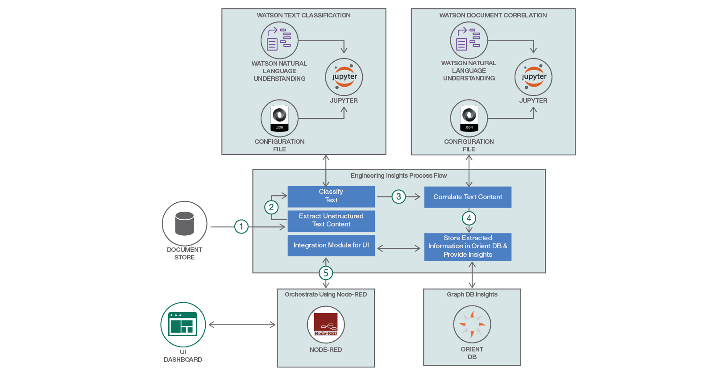
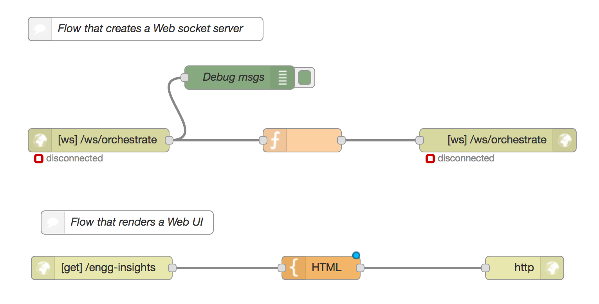
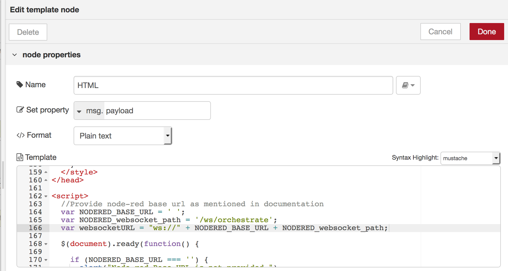
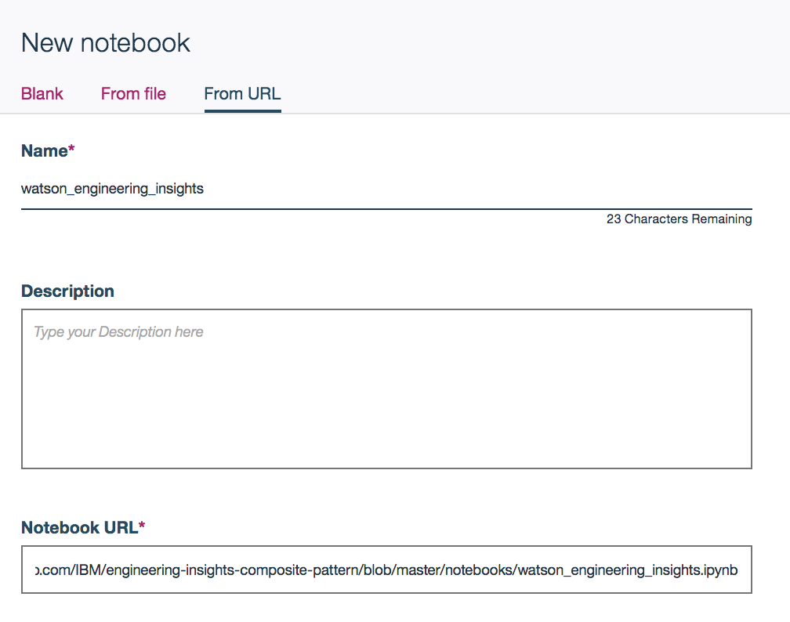
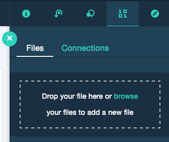
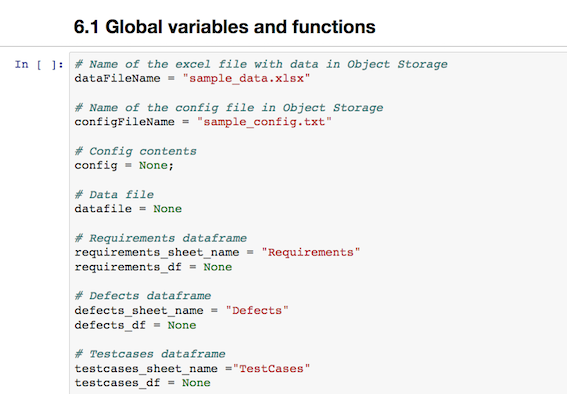
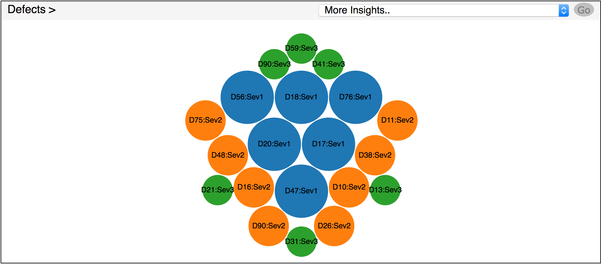
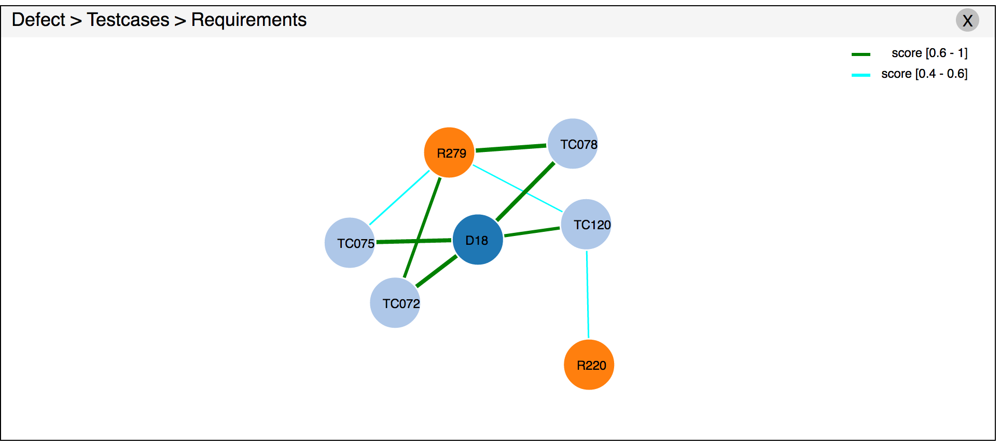
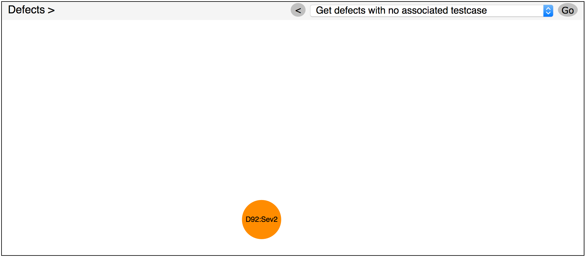

# Engineering Insights - A composite pattern. 

The problem that we address in this pattern is in the domain of software development lifecycle. In the software development lifecycle, there are many artifacts that are generated - requirments, testcases, defects etc. In long running software projects with minimal tool support and a churn of team members, the new team members face many questions: 
- What requirement does this defect correlate to?
- What are the testcases that I need to execute after a defect is fixed?
and so on.

The composite pattern demonstrates a solution to this problem using a combination of other individual code patterns.  

When the reader has completed this journey, they will understand how to:
- Classify the unstructured text content in the document artifacts
- Correlate the text content to find the best matching artifacts
- Store the artifact data and correlations in a graph database
- Query the graph database for insights
- Submit the request and visualize the results on a Web UI

The intended audience for this journey are developers who want to learn a method for building a solution with queryable insights on unstructured text content across documents. The distinguishing factor of this journey is that it allows a configurable mechanism to achieve the insights. 

The pattern also demonstrates an **interactive user interface using D3.js** which allows an user to drill down to get more insights on the artifacts. [D3.js](https://d3js.org/) is a JavaScript library for producing dynamic, interactive data visualizations in web browsers. It makes use of the widely implemented SVG, HTML5, and CSS standards.

1. The unstructured text data that need to be analyzed and correlated is extracted from the documents using custom python code.
2. The text is classified and tagged using the code pattern - [Extend Watson text classification](https://github.com/IBM/watson-document-classifier)
3. The text is correlated with other text using the code pattern - [Correlate documents](https://github.com/IBM/watson-document-co-relation)  
4. The document data and correlations are stored in the Orient DB database using the code pattern [Store, graph, and derive insights from interconnected data](https://github.com/IBM/graph-db-insights)
5. The analytics solution on IBM Data Science Experience is invoked and visualized using the code pattern - [Orchestrate data science workflows using Node-RED](https://github.com/IBM/node-red-dsx-workflow)

## Included components

* [IBM Data Science Experience](https://www.ibm.com/bs-en/marketplace/data-science-experience): Analyze data using RStudio, Jupyter, and Python in a configured, collaborative environment that includes IBM value-adds, such as managed Spark.

* [IBM Cloud Object Storage](https://console.ng.bluemix.net/catalog/services/object-storage/?cm_sp=dw-bluemix-_-code-_-devcenter): An IBM Cloud service that provides an unstructured cloud data store to build and deliver cost effective apps and services with high reliability and fast speed to market.

* [Watson Natural Language Understanding](https://console.bluemix.net/catalog/services/natural-language-understanding/?cm_sp=dw-bluemix-_-code-_-devcenter): An IBM Cloud service that can analyze text to extract meta-data from content such as concepts, entities, keywords, categories, sentiment, emotion, relations, semantic roles, using natural language understanding.

* [Node-RED](https://console.bluemix.net/catalog/starters/node-red-starter): Node-RED is a programming tool for wiring together APIs and online services.

* [OrientDB](http://orientdb.com/orientdb/): A Multi-Model Open Source NoSQL DBMS.

* [Kubernetes Clusters](https://console.bluemix.net/containers-kubernetes/launch): an open-source system for automating deployment, scaling, and management of containerized applications.

## Featured technologies

* [Data Science](https://medium.com/ibm-data-science-experience/): Systems and scientific methods to analyze structured and unstructured data in order to extract knowledge and insights.

* [Graph Database](https://en.wikipedia.org/wiki/Graph_database): A graph database is a database that uses graph structures for semantic queries with nodes, edges and properties to represent and store data. A key concept of the system is the graph (or edge or relationship), which directly relates data items in the store. The relationships allow data in the store to be linked together directly, and in many cases retrieved with one operation.

# Watch the Video
 

# Steps

Follow these steps to setup and run this developer journey. The steps are
described in detail below.

1. [Sign up for the Data Science Experience](#1-sign-up-for-the-data-science-experience)
1. [Create IBM Cloud services](#2-create-ibm-cloud-services)
1. [Import the Node-RED flow](#3-import-the-node-red-flow)
1. [Note the websocket URL](#4-note-the-websocket-url)
1. [Update the websocket URL](#5-update-the-websocket-url-in-html-code)
1. [Deploy OrientDB on Kubernetes Cluster](#6-deploy-orientdb-on-kubernetes-cluster)
1. [Create the notebook](#7-create-the-notebook)
1. [Add the data and configuraton file](#8-add-the-data-and-configuration-file)
1. [Update the notebook with service credentials](#9-update-the-notebook-with-service-credentials)
1. [Run the notebook](#10-run-the-notebook)
1. [Analyze the results](#11-analyze-the-results)

## 1. Sign up for the Data Science Experience

Sign up for IBM's [Data Science Experience](http://datascience.ibm.com/). By signing up for the Data Science Experience, two services: ``DSX-Spark`` and ``DSX-ObjectStore`` will be created in your IBM Cloud account.

## 2. Create IBM Cloud services

Create the IBM Cloud services required for the individual code patterns:

  * [Extend Watson text classification](https://github.com/IBM/watson-document-classifier/#2-create-bluemix-services)
  * [Orchestrate data science workflows using Node-RED](https://github.com/IBM/node-red-dsx-workflow#2-create-bluemix-services)

## 3. Import the Node-RED flow
* [Clone this repo](https://github.com/IBM/engineering-insights-composite-pattern).
* Navigate to the [orchestrate_dsx_workflow.json](https://github.com/IBM/engineering-insights-composite-pattern/blob/master/node-red-flow/orchestrate_dsx_workflow.json).
* Open the file with a text editor and copy the contents to Clipboard.
* On the Node-RED flow editor, click the Menu and select `Import -> Clipboard` and paste the contents.

 
  
  
 
 #### Deploy the Node-RED flow by clicking on the `Deploy` button

## 4. Note the websocket URL

The websocket URL is ws://`<NODERED_BASE_URL>`/ws/orchestrate  where the `NODERED_BASE_URL` is the marked portion of the URL in the above image.
### Note:
An example websocket URL for a Node-RED app with name `myApp` is `ws://myApp.mybluemix.net/ws/orchestrate`, where `myApp.mybluemix.net` is the NODERED_BASE_URL. 

The NODERED_BASE_URL may have additional region information i.e. `eu-gb` for the UK region. In this case NODERED_BASE_URL would be: `myApp.eu-gb.mybluemix.net`. 

## 5. Update the websocket URL in HTML code
Click on the node named `HTML`.

Click on the HTML area and search for `ws:` to locate the line where the websocket URL is specified. 
Update the websocket URL with the base URL that was noted in the [Section 4](#4-note-the-websocket-url): 	

	var websocketURL = "ws://" + NODERED_BASE_URL + NODERED_websocket_path;
	

Click on `Done` and re-deploy the flow.

## 6. Deploy OrientDB on Kubernetes Cluster
Deploy OrientDB on Kubernetes cluster using [Deploy OrientDB on Kubernetes](https://github.com/IBM/deploy-graph-db-container). It will expose the ports on IBM Cloud through which OrientDB can be accessed from the Jupyter notebook on IBM DSX. Use the `ip-address of your cluster` and node port `port 2424` on which the OrientDB console is mapped, to access that OrientDB through Jupyter notebook. 

## 7. Create the notebook

In [Data Science Experience](http://datascience.ibm.com/):

Use the menu on the top to select `Projects` and then `Default Project`. 
Click on `Add notebooks` (upper right) to create a notebook.

* Select the `From URL` tab.
* Enter a name for the notebook.
* Optionally, enter a description for the notebook.
* Enter this Notebook URL: https://github.com/IBM/engineering-insights-composite-pattern/blob/master/notebooks/watson_engineering_insights.ipynb
* Click the `Create Notebook` button.

## 8. Add the data and configuration file

#### Add the data and configuration to the notebook

* From the `My Projects > Default` page, Use `Find and Add Data` (look for the `10/01` icon)
and its `Files` tab. 
* Click `browse` and navigate to this repo `engineering-insights-composite-pattern/data/sample_data.xlsx`
* Click `browse` and navigate to this repo `engineering-insights-composite-pattern/configuration/sample_config.txt`

> Note:  It is possible to use your own data and configuration files.
If you use a configuration file from your computer, make sure to conform to the JSON structure given in `configuration/sample_config.txt`.

#### Fix-up file names for your own data and configuration files

If you use your own data and configuration files, you will need to update the variables that refer to the data and configuration files in the Jupyter Notebook.

In the notebook, update the global variables in the cell following `6.1 Global Variables` section.

Replace the values for `dataFileName` variable with the name of your data file and `configFileName` with your configuration file name.

#### Fix-up sheet names in the excel data file

The data for the different artifacts are on different sheets of the excel file. If you use your own naming convention for the excel sheet names, update the global variables in the cell following `6.1 Global Variables` section in the notebook.
Replace the values for `requirements_sheet_name`,`defects_sheet_name` and `testcases_sheet_name` with the corresponding sheet names in the data excel file.

## 9. Update the notebook with service credentials

#### Add the Watson Natural Language Understanding credentials to the notebook
Select the cell below `2.1 Add your service credentials from Bluemix for the Watson services` section in the notebook to update the credentials for Watson Natural Langauage Understanding. 

Open the Watson Natural Language Understanding service in your [IBM Cloud Dashboard](https://console.bluemix.net/dashboard/services) and click on your service created in section [Create IBM Cloud services](#2-create-ibm-cloud-services).
Once the service is open click the `Service Credentials` menu on the left.

In the `Service Credentials` that opens up in the UI, select whichever `Credentials` you would like to use in the notebook from the `KEY NAME` column. Click `View credentials` and copy `username` and `password` key values that appear on the UI in JSON format.

Update the `username` and `password` key values in the cell below `2.1 Add your service credentials from IBM Cloud for the Watson services` section.

#### Add the Object Storage credentials to the notebook
* Select the cell below `2.2 Add your service credentials for Object Storage` section in the notebook to update the credentials for Object Store. 
* Delete the contents of the cell

* Use `Find and Add Data` (look for the `10/01` icon) and its `Files` tab. You should see the file names uploaded earlier. Make sure your active cell is the empty one below `2.2 Add...`  
* Select `Insert to code` (below your sample_text.txt). 
* Click `Insert Credentials` from drop down menu.
* Make sure the credentials are saved as `credentials_1`.

#### Update the OrientDB credentials in the notebook
* In the cell below `Connect to OrientDB`, enter the hostname, port, username and password.

#### Update the websocket URL in the notebook
* In the cell below `6. Expose integration point with a websocket client` , update the websocket url noted in [section 4](#4-note-the-websocket-url) in the `start_websocket_listener` function.

## 10. Run the notebook

When a notebook is executed, what is actually happening is that each code cell in
the notebook is executed, in order, from top to bottom.

> IMPORTANT: The first time you run your notebook, you will need to install the necessary
packages in section 1.1 and then `Restart the kernel`.

Each code cell is selectable and is preceded by a tag in the left margin. The tag
format is `In [x]:`. Depending on the state of the notebook, the `x` can be:

* A blank, this indicates that the cell has never been executed.
* A number, this number represents the relative order this code step was executed.
* A `*`, this indicates that the cell is currently executing.

There are several ways to execute the code cells in your notebook:

* One cell at a time.
  * Select the cell, and then press the `Play` button in the toolbar.
* Batch mode, in sequential order.
  * From the `Cell` menu bar, there are several options available. For example, you
    can `Run All` cells in your notebook, or you can `Run All Below`, that will
    start executing from the first cell under the currently selected cell, and then
    continue executing all cells that follow.
* At a scheduled time.
  * Press the `Schedule` button located in the top right section of your notebook
    panel. Here you can schedule your notebook to be executed once at some future
    time, or repeatedly at your specified interval.

## 11. Analyze the results

The UI can be accessed at the URL: http://`<NODERED_BASE_URL>`/engginsights. 
The `<NODERED_BASE_URL>` is the base URL noted in section [Note the websocket URL](#4-note-the-websocket-url).

On the UI, you can get the list of defects, testcases or requirements. 

Selecting `Defects` displays the list of all defects.

Clicking on a defect shows all the mapped testcases and requirements.

Similarly, for testcases - clicking on a testcase will display all the mapped requirements.

We can also get more insights like:
- Get defects with no testcases
- Get testcases that have no defects
- Get all defects of a given severity
- Get requirements that have no testcases

and so on.

Such insights can help in getting the related testcases and requirements for a defect that can help in testcase execution optimization.

The below image lists all the defects that have no associated testcases. 

The solution can be enhanced through the following mechanisms.
* Enhance sample-config.txt - The configuration file can be enhanced to classify and tag the text to give better results. We know that authentication, login and password can refer to the same feature. All these words can be tagged to the same class to provide better text correlation.
* Enhance text similarity - The text similarity code can be enhanced to add lemmatization and spell corrections based on the solution need. `Login` can be misspelt as `Logn`. This text will not be tagged correctly. A spell correction can handle this scenario to provide better results.
* Add more insights - More OrientDB queries can be written for more insights.

# Troubleshooting

[See DEBUGGING.md.](DEBUGGING.md)

# License

[Apache 2.0](LICENSE)
