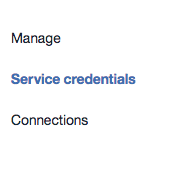
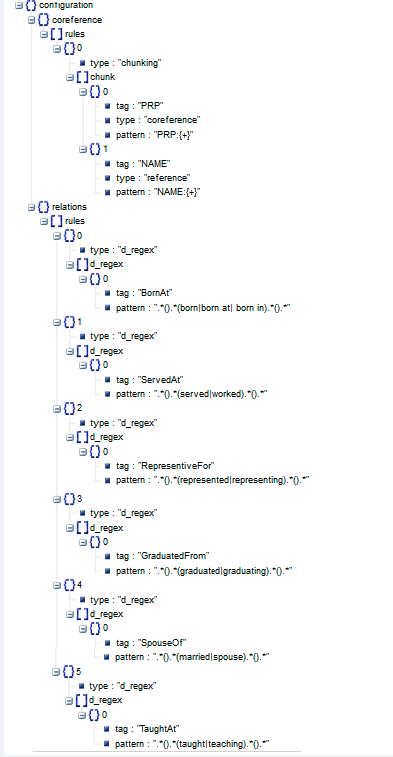
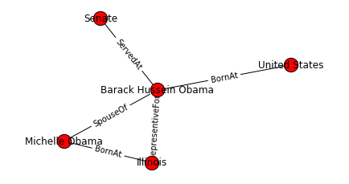

# Engineering Insights - A composite pattern

The problem that we address in this pattern is in the domain of software development lifecycle. In the software development lifecycle, there are many artifacts that are generated - requirments, testcases, defects etc. In long running software projects with minimal tool support and a churn of team members, the new team members face many questions: 
- What requirement does this defect correlate to?
- What are the testcases that I need to execute after a defect is fixed?
and so on.

The composite pattern demonstrates a solution to this problem using a combination of other individual code patterns.  

When the reader has completed this journey, they will understand how to:
- Classify the unstructured text content in the document artifacts
- Correlate the text content to find the best matching artifacts
- Store the artifact data and correlations in a graph database
- Query the graph database for insights
- Submit the request and visualize the results on a Web UI

The intended audience for this journey are developers who want to learn a method for building a solution with queryable insights on unstructured text content across documents. The distinguishing factor of this journey is that it allows a configurable mechanism to achieve the insights. 

1. The unstructured data that need to be analyzed and correlated is extracted from the documents.
2. The text is classified and tagged using the code pattern - [Extend Watson text classification](https://github.com/IBM/watson-document-classifier)
3. The text is correlated with other text using the code pattern - [Correlate documents](https://github.com/IBM/watson-document-co-relation)  
4. The document data and correlations are stored in the Orient DB database using the code pattern [Store, graph, and derive insights from interconnected data](https://github.com/IBM/graph-db-insights)
5. The analytics solution on IBM Data Science Experience can be invoked and visualized using the code pattern - [Orchestrate data science workflows using Node-RED](https://github.com/IBM/node-red-dsx-workflow)

## Included components

* [IBM Data Science Experience](https://www.ibm.com/bs-en/marketplace/data-science-experience): Analyze data using RStudio, Jupyter, and Python in a configured, collaborative environment that includes IBM value-adds, such as managed Spark.

* [Bluemix Object Storage](https://console.ng.bluemix.net/catalog/services/object-storage/?cm_sp=dw-bluemix-_-code-_-devcenter): A Bluemix service that provides an unstructured cloud data store to build and deliver cost effective apps and services with high reliability and fast speed to market.

* [Watson Natural Language Understanding](https://console.bluemix.net/catalog/services/natural-language-understanding/?cm_sp=dw-bluemix-_-code-_-devcenter): A Bluemix service that can analyze text to extract meta-data from content such as concepts, entities, keywords, categories, sentiment, emotion, relations, semantic roles, using natural language understanding.

* [Node-RED](https://console.bluemix.net/catalog/starters/node-red-starter): Node-RED is a programming tool for wiring together APIs and online services.

* [OrientDB](http://orientdb.com/orientdb/): A Multi-Model Open Source NoSQL DBMS.

* [Kubernetes Clusters](https://console.bluemix.net/containers-kubernetes/launch): an open-source system for automating deployment, scaling, and management of containerized applications.

## Featured technologies

* [Data Science](https://medium.com/ibm-data-science-experience/): Systems and scientific methods to analyze structured and unstructured data in order to extract knowledge and insights.

* [Graph Database](https://en.wikipedia.org/wiki/Graph_database): A graph database is a database that uses graph structures for semantic queries with nodes, edges and properties to represent and store data. A key concept of the system is the graph (or edge or relationship), which directly relates data items in the store. The relationships allow data in the store to be linked together directly, and in many cases retrieved with one operation.

# Watch the Video
TODO

# Steps

Follow these steps to setup and run this developer journey. The steps are
described in detail below.

1. [Sign up for the Data Science Experience](#1-sign-up-for-the-data-science-experience)
1. [Create Bluemix services](#2-create-bluemix-services)
1. [Deploy OrientDB on Kubernetes Cluster](#3-deploy-orientdb-on-kubernetes-cluster)
1. [Create the notebook](#4-create-the-notebook)
1. [Add the data and configuraton file](#5-add-the-data-and-configuration-file)
1. [Update the notebook with service credentials](#6-update-the-notebook-with-service-credentials)
1. [Run the notebook](#7-run-the-notebook)
1. [Analyze the results](#8-analyze-the-results)

## 1. Sign up for the Data Science Experience

Sign up for IBM's [Data Science Experience](http://datascience.ibm.com/). By signing up for the Data Science Experience, two services: ``DSX-Spark`` and ``DSX-ObjectStore`` will be created in your Bluemix account.

## 2. Create Bluemix services

Create the Bluemix services required for the individual code patterns:

  * [**Extend Watson text classification**](https://github.com/IBM/watson-document-classifier/#2-create-bluemix-services)
  * [**Orchestrate data science workflows using Node-RED**](https://github.com/IBM/node-red-dsx-workflow#2-create-bluemix-services)
  
## 3. Deploy OrientDB on Kubernetes Cluster
Deploy OrientDB on Kubernetes cluster using [Deploy OrientDB on Kubernetes](https://github.com/IBM/deploy-graph-db-container). It will expose the ports on IBM Bluemix through which OrientDB can be accessed from the Jupyter notebook on IBM DSX. Use the `ip-address of your cluster` and node port `port 2424` on which the OrientDB console is mapped, to access that OrientDB through Jupyter notebook. 

## 4. Create the notebook

In [Data Science Experience](http://datascience.ibm.com/):

Use the menu on the top to select `Projects` and then `Default Project`. 
Click on `Add notebooks` (upper right) to create a notebook.

* Select the `From URL` tab.
* Enter a name for the notebook.
* Optionally, enter a description for the notebook.
* Enter this Notebook URL: https://github.com/IBM/engineering-insights-composite-pattern/blob/master/notebooks/watson_engineering_insights.ipynb
* Click the `Create Notebook` button.

## 5. Add the data and configuration file

#### Add the data and configuration to the notebook

* From the `My Projects > Default` page, Use `Find and Add Data` (look for the `10/01` icon)
and its `Files` tab. 
* Click `browse` and navigate to this repo `engineering-insights-composite-pattern/data/engineering_insights_data.xlsx`
* Click `browse` and navigate to this repo `engineering-insights-composite-pattern/configuration/config.txt`

> Note:  It is possible to use your own data and configuration files.
If you use a configuration file from your computer, make sure to conform to the JSON structure given in `configuration/config.txt`.

#### Fix-up file names for your own data and configuration files

If you use your own data and configuration files, you will need to update the variables that refer to the data and configuration files in the Jupyter Notebook.

In the notebook, update the global variables in the cell following `2.3 Global Variables` section.

Replace the values for `dataFileName` variable with the name of your data file and `configFileName` with your configuration file name.

#### Fix-up sheet names in the excel data file

The data for the different artifacts are on different sheets of the excel file. If you use your own naming convention for the excel sheet names, update the global variables in the cell following `2.3 Global Variables` section in the notebook.
Replace the values for `requirements_sheet_name`,`defects_sheet_name` and `testcases_sheet_name` with the corresponding sheet names in the data excel file.

## 6. Update the notebook with service credentials

#### Add the Watson Natural Language Understanding credentials to the notebook
Select the cell below `2.1 Add your service credentials from Bluemix for the Watson services` section in the notebook to update the credentials for Watson Natural Langauage Understanding. 

Open the Watson Natural Language Understanding service in your [Bluemix Dashboard](https://console.bluemix.net/dashboard/services) and click on your service, which you should have named `wdc-NLU-service`.

Once the service is open click the `Service Credentials` menu on the left.

In the `Service Credentials` that opens up in the UI, select whichever `Credentials` you would like to use in the notebook from the `KEY NAME` column. Click `View credentials` and copy `username` and `password` key values that appear on the UI in JSON format.

Update the `username` and `password` key values in the cell below `2.1 Add your service credentials from Bluemix for the Watson services` section.

#### Add the Object Storage credentials to the notebook
* Select the cell below `2.2 Add your service credentials for Object Storage` section in the notebook to update the credentials for Object Store. 
* Delete the contents of the cell

* Use `Find and Add Data` (look for the `10/01` icon) and its `Files` tab. You should see the file names uploaded earlier. Make sure your active cell is the empty one below `2.2 Add...`  
* Select `Insert to code` (below your sample_text.txt). 
* Click `Insert Crendentials` from drop down menu.
* Make sure the credentials are saved as `credentials_1`.

## 7. Run the notebook

When a notebook is executed, what is actually happening is that each code cell in
the notebook is executed, in order, from top to bottom.

> IMPORTANT: The first time you run your notebook, you will need to install the necessary
packages in section 1.1 and then `Restart the kernel`.

Each code cell is selectable and is preceded by a tag in the left margin. The tag
format is `In [x]:`. Depending on the state of the notebook, the `x` can be:

* A blank, this indicates that the cell has never been executed.
* A number, this number represents the relative order this code step was executed.
* A `*`, this indicates that the cell is currently executing.

There are several ways to execute the code cells in your notebook:

* One cell at a time.
  * Select the cell, and then press the `Play` button in the toolbar.
* Batch mode, in sequential order.
  * From the `Cell` menu bar, there are several options available. For example, you
    can `Run All` cells in your notebook, or you can `Run All Below`, that will
    start executing from the first cell under the currently selected cell, and then
    continue executing all cells that follow.
* At a scheduled time.
  * Press the `Schedule` button located in the top right section of your notebook
    panel. Here you can schedule your notebook to be executed once at some future
    time, or repeatedly at your specified interval.

## 8. Analyze the results

After running each cell of the notebook under Correlate text, the results will display. 

The configuration json controls the way the text is correlated. The correlation involves two aspects - co-referencing and relation determination. The configuration json contains the rules and grammar for co-referencing  and determining relations. The output from Watson Natural Language Understanding and Python NLTK toolkit is processed based on the rules and grammar specified in the configuration json to come up with the correlation of content across documents. 

We can modify the configuration json to add more rules and grammar for co-referencing and determining the relations. The text content correlation results can be enhanced without changes to the code.

We can see from the `6. Visualize correlated text` in the notebook the correlations between the text in the two sample documents that we provided.

# Troubleshooting

[See DEBUGGING.md.](DEBUGGING.md)

# License

[Apache 2.0](LICENSE)
